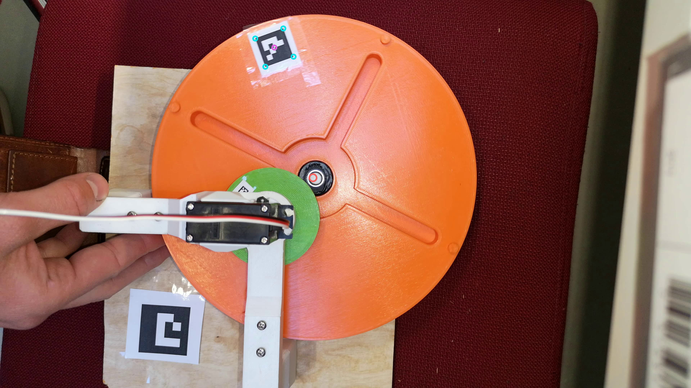

Applied mechanics project at Chalmers university of technology. 

### Image above shows the detection algorithm finding the fiducial marker in a frame of a video during use of the Geneva-drive. Red circle indicates the calculated centerpoint of the geneva-drive drive-disc. 

A comparions on the meassured vibration on a Geneva drive with an Adams simulation. A digital image correlation method is created for the meassuring of the rotation angle of the Geneva drive disc using fiducial markers. 
The report can be found here [Download](https://github.com/gurrajo/Geneva/blob/master/Slutrapport___Geneva_Drive.pdf)
